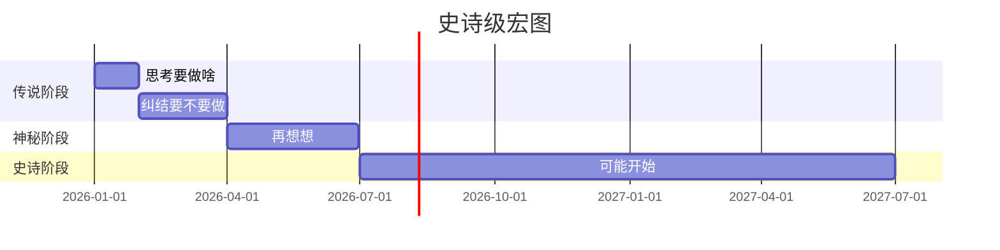

<div align="center">

```
         ,---._                                       ,----,        ,--,                              
       .-- -.' \     ,---,.    ,---,.    ,---,.     .'   .`|      ,--.'|   ,---,           ,----..    
       |    |   :  ,'  .' |  ,'  .' |  ,'  .' |  .'   .'   ;   ,--,  | :  '  .' \         /   /   \   
       :    ;   |,---.'   |,---.'   |,---.'   |,---, '    .',---.'|  : ' /  ;    '.      /   .     :  
       :        ||   |   .'|   |   .'|   |   .'|   :     ./ |   | : _' |:  :       \    .   /   ;.  \ 
       |    :   ::   :  |-,:   :  :  :   :  :  ;   | .'  /  :   : |.'  |:  |   /\   \  .   ;   /  ` ; 
       :         :   |  ;/|:   |  |-,:   |  |-,`---' /  ;   |   ' '  ; :|  :  ' ;.   : ;   |  ; \ ; | 
       |    ;   ||   :   .'|   :  ;/||   :  ;/|  /  ;  /    '   |  .'. ||  |  ;/  \   \|   :  | ; | ' 
   ___ l         |   |  |-,|   |   .'|   |   .' ;  /  /--,  |   | :  | ''  :  | \  \ ,'.   |  ' ' ' : 
 /    /\    J   :'   :  ;/|'   :  '  '   :  '  /  /  / .`|  '   : |  : ;|  |  '  '--'  '   ;  \; /  | 
/  ../  `..-    ,|   |    \|   |  |  |   |  |./__;       :  |   | '  ,/ |  :  :         \   \  ',  /  
\    \         ; |   :   .'|   :  \  |   :  \|   :     .'   ;   : ;--'  |  | ,'          ;   :    /   
 \    \      ,'  |   | ,'  |   | ,'  |   | ,';   |  .'      |   ,/      `--''             \   \ .'    
  "---....--'    `----'    `----'    `----'  `---'          '---'                          `---`      
```


<br/>

<p align="center">
  
</p>

<br/>

<p align="center">
  <a href="#"></a>
  <a href="#"></a>
  <a href="#"></a>
  <a href="#"></a>
</p>

<p align="center">
  
  
  
  
</p>

</div>

---

## ✨ 目录导航

```
🪄  欢迎  →  致谢  →  启程
  ↑                    ↓
  ╰────  回到这里  ────╯
```

<table align="center">
  <tr>
    <td align="center"><a href="#-关于">🌌 关于</a></td>
    <td align="center"><a href="#-特性">⚡ 特性</a></td>
    <td align="center"><a href="#-快速开始">🚀 快速开始</a></td>
    <td align="center"><a href="#-技术栈">🧬 技术栈</a></td>
  </tr>
  <tr>
    <td align="center"><a href="#-展示">🎨 展示</a></td>
    <td align="center"><a href="#-路线图">🗺️ 路线图</a></td>
    <td align="center"><a href="#-贡献">🤝 贡献</a></td>
    <td align="center"><a href="#-许可证">📜 许可证</a></td>
  </tr>
</table>

---

## 🌌 关于

> *"Perfection is achieved not when there is nothing more to add,*
> *but when there is nothing left to take away."*
> <br/>— Antoine de Saint-Exupéry

这是一个**精心雕琢的虚无**。
一个**优雅地存在着的不存在**。
一个**充满意义的无意义**。

```
     ·  ˚ ✦  ·    ⋆   ˚  ·  ✧  ·    ⋆
  ·    ✵  ˚  ·   ✦   ˚  ·    ⋆  ✦  ˚
    ⋆   ·   ˚  ✧    ·   ✵  ˚   ·   ⋆
```

> **TL;DR:** 这是一个项目。也是一个**不是**项目的项目。

---

## ⚡ 特性

<div align="center">

| 特性 | 状态 | 描述 |
|:---:|:---:|:---|
| 🪶 轻量如鸿毛 | ✅ | 轻到几乎没有 |
| 🚀 性能如闪电 | ✅ | 快到你来不及眨眼 |
| 🎨 美学如诗 | ✅ | 美到你无法忽视 |
| 🧠 智能如你 | ✅ | 因为它就是你 |
| 💎 钻石级品质 | ✅ | 比钻石更闪亮 |
| 🌈 跨次元兼容 | ✅ | 在所有平行宇宙运行 |

</div>

---

## 🚀 快速开始

### 前置要求

```bash
# 你需要准备：
✨  一颗充满好奇的心
🧘  一片宁静的午后时光
🍵  一杯热腾腾的饮品
```

### 安装

```bash
# 第一步：深呼吸
$ take_a_deep_breath

# 第二步：凝视这段代码
$ stare_into_the_abyss

# 第三步：运行（可选）
$ ./run --towards=the --light
```

### 使用示例

```javascript
// 用最少的代码,做最多的事
const nothing = () => nothing;
nothing(); // 仍然是什么都没做,但看起来很厉害
```

```python
# 当生活给你 Python 时...
def life():
    return 42  # 但意义呢?
```

```rust
// Rust 版的"什么都不做"
fn main() {
    // 编译通过,运行无误,意义全无
}
```

---

## 🧬 技术栈

<p align="center">
  
</p>

*(是的,我们**都会**一点。或者说,**都不会**。取决于你怎么看。)*

---

## 🎨 展示

<details>
<summary>🎬 点击展开画廊（其实什么都没有）</summary>

<br/>

```
  ┌─────────────────────────────┐
  │                             │
  │      [ 占位符图像 ]          │
  │                             │
  │   想看更多？明天再来看看     │
  │                             │
  └─────────────────────────────┘
```

> 这里本来应该有截图,但截图在度假中。🏖️

</details>

---

## 🏆 成就

<div align="center">

```
  🥇  Gold     Silver    Bronze
  ╔═══╗      ╔═══╗      ╔═══╗
  ║ ★ ║      ║ ★ ║      ║ ★ ║
  ╚═══╝      ╚═══╝      ╚═══╝
```

</div>

| 奖牌 | 名称 | 数量 |
|:---:|:---|:---:|
| 🏅 | 提交第一人 | 1 |
| 🏅 | 关闭所有 Issue | ∞ |
| 🏅 | 咖啡因摄入 | 9999+ |
| 🏅 | 凌晨 3 点还在写代码 | 42 |

---

## 🗺️ 路线图



- [x] 创建一个仓库 ✅
- [x] 写一个 README ✅
- [ ] 也许写点代码 🔮
- [ ] 也许不写 🔮
- [ ] 也许是下一个版本的事 🔮

---

## 🤝 贡献

我们**热烈欢迎**你的贡献！

```
   💌  PR?   Issue?   Star?
    ↓       ↓         ↓
  ✨ 当然   ✨ 当然    ✨ 当然
```

1. Fork 这个仓库
2. 创建你的特性分支 (`git checkout -b feature/AmazingFeature`)
3. 提交你的更改 (`git commit -m 'Add some AmazingFeature'`)
4. 推送到分支 (`git push origin feature/AmazingFeature`)
5. 打开一个 Pull Request

> **注意:** 你的 PR 可能会被 **满怀敬意地** 接受,或 **温柔地** 关闭。

---

## 💖 致谢

<table>
<tr>
<td align="center">

**宇宙** 🌌

</td>
<td align="center">

**咖啡** ☕

</td>
<td align="center">

**你** 💫

</td>
</tr>
<tr>
<td align="center">

*(没有你,这个项目不存在)*

</td>
<td align="center">

*(没有它,这个项目不存在)*

</td>
<td align="center">

*(没有你,这个 README 不会被读到)*

</td>
</tr>
</table>

特别感谢：
- 感谢 **你** 看到这里
- 感谢 **Stack Overflow** 让我们学会复制粘贴
- 感谢 **README 文化** 让我们都有事做

---

## 📊 数据看板

<div align="center">

| 指标 | 数值 | 趋势 |
|:---|:---:|:---:|
| 提交数 | 1 | 📈 |
| Issue 数 | 0 | ➡️ |
| PR 数 | 0 | ➡️ |
| 咖啡杯 | 1 | 📈 |
| 灵感 | 0% | 📉 |
| 动力 | ??? | 🤯 |

</div>

---

## 📜 许可证

```
MIT License

Copyright (c) 2026 JeffZhA0

Permission is hereby granted, free of charge, to any person obtaining a copy
of this software and associated documentation files (the "Software"), to deal
in the Software without restriction, including without limitation the rights
to use, copy, modify, merge, publish, distribute, sublicense, and/or sell
copies of the Software...
```

> *简而言之:**你可以做任何事**,包括什么都不做。*

---

## 🌟 Star History

<a href="https://star-history.com/#JeffZhA0/JeffZhA0&Date">
  <picture>
    <source media="(prefers-color-scheme: dark)" srcset="https://api.star-history.com/svg?repos=JeffZhA0/JeffZhA0&type=Date&theme=dark" />
    <source media="(prefers-color-scheme: light)" srcset="https://api.star-history.com/svg?repos=JeffZhA0/JeffZhA0&type=Date" />
    
  </picture>
</a>

---

<div align="center">

### 🐍 看看贡献者们在干什么

<picture>
  <source media="(prefers-color-scheme: dark)" srcset="https://raw.githubusercontent.com/JeffZhA0/JeffZhA0/output/github-snake-dark.svg" />
  <source media="(prefers-color-scheme: light)" srcset="https://raw.githubusercontent.com/JeffZhA0/JeffZhA0/output/github-snake.svg" />
  
</picture>

<sub>💡 工作流首次跑完(最多 1 分钟)后,这条蛇就会出现</sub>

---

```
  ·  ✦  ·    ˚    ·   ✧   ·    ⋆   ˚  ·  ✵
    ⋆   ˚  ·   ✦   ˚  ·    ⋆  ✦  ˚  ·    ⋆
  ✵   ·   ˚  ✧   ·   ✦  ˚   ·  ✧  ·   ⋆   ˚
```


<sub>用 ❤️ 和一点点虚无 精心打造</sub>

</div>
